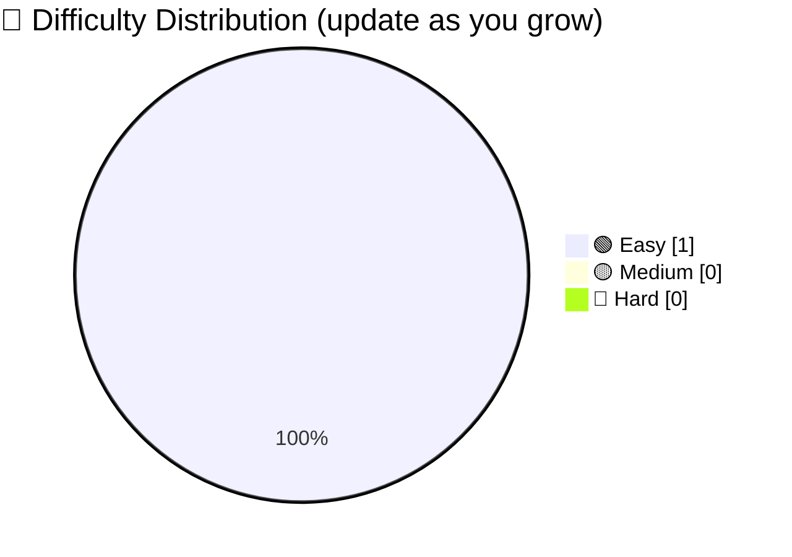
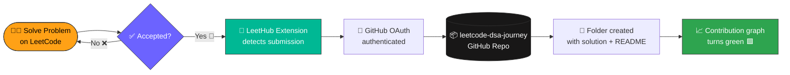
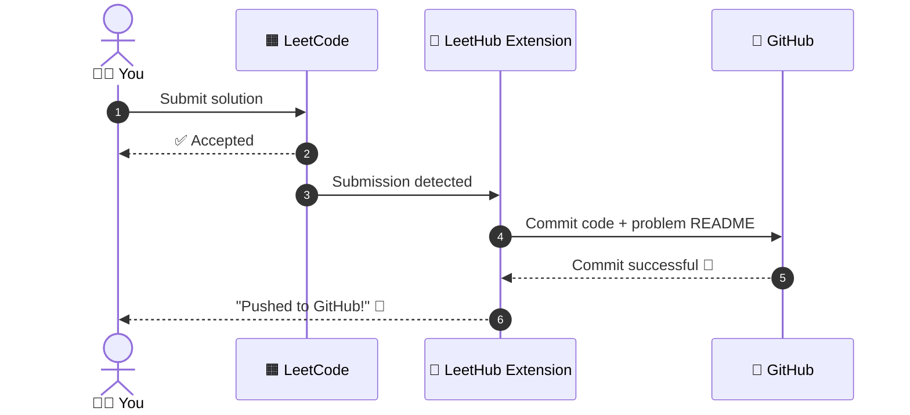
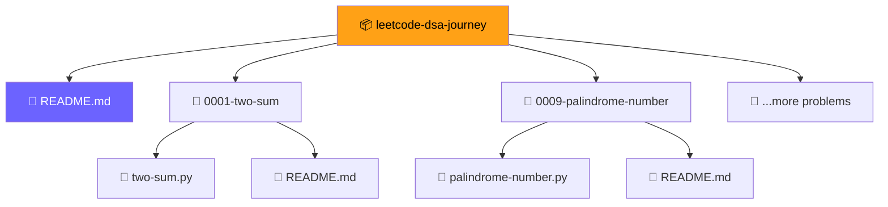
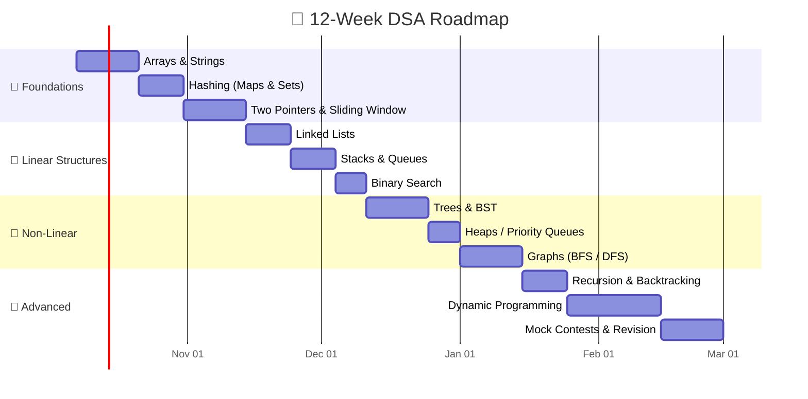
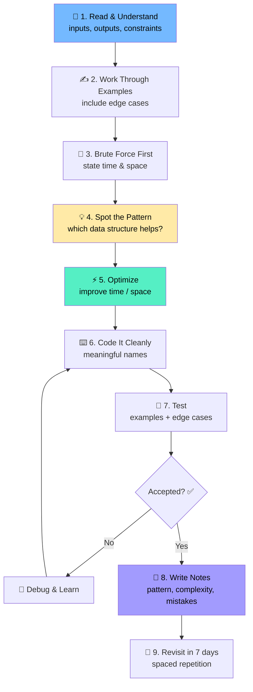

<div align="center">

# 🧠 LeetCode DSA Journey

### *One problem a day. One pattern at a time. One step closer to mastery.* 🚀


<br/>

[](https://leetcode.com/u/sujalrajpoot/)
[](https://github.com/sujalrajpoot)
[](https://sujalrajpoot.vercel.app)


</div>

---

## 📑 Table of Contents

- [👋 About Me](#-about-me)
- [🎯 Goals & Motivation](#-goals--motivation)
- [📊 Live Stats](#-live-stats)
- [🔄 How the Auto-Sync Works](#-how-the-auto-sync-works)
- [⚙️ Setup Guide (LeetCode ➜ GitHub)](#️-setup-guide-leetcode--github)
- [📂 Repository Structure](#-repository-structure)
- [🗺️ DSA Roadmap](#️-dsa-roadmap)
- [🧩 Pattern Cheat Sheet](#-pattern-cheat-sheet)
- [📈 Progress Tracker](#-progress-tracker)
- [🧠 My Problem-Solving Framework](#-my-problem-solving-framework)
- [🗂️ Solution Template](#️-solution-template)
- [📅 Daily Routine](#-daily-routine)
- [🛠️ Tech Stack & Tools](#️-tech-stack--tools)
- [📚 Resources](#-resources)
- [🤝 Contributing](#-contributing)
- [📬 Connect With Me](#-connect-with-me)

---

## 👋 About Me

<table>
<tr>
<td>

**Hi, I'm Sujal Rajpoot** 👨‍💻

🚀 Full Stack Python Developer
🤖 AI Engineer
🏢 Founder @ **TrueSyncAI** — building emotionally intelligent AI
🌍 Open Source Contributor
📍 India 🇮🇳

</td>
<td>

I'm building a rock-solid foundation in **Data Structures & Algorithms** because great software starts with great fundamentals. This repository is my **public learning log**: every solution, every mistake, every *"aha!"* moment. 💡

</td>
</tr>
</table>

> [!NOTE]
> 🐍 All solutions in this repo are written in **Python**, my primary language.

---

## 🗺️ Roadmap

I’m following the **[NeetCode Roadmap](https://neetcode.io/roadmap)** as my structured path for learning **Data Structures & Algorithms**.

It provides a well-organized progression through essential DSA topics, helping me build strong problem-solving fundamentals and prepare for **coding interviews**.
---


# NeetCode DSA Roadmap

This repository contains solutions to the **150 essential Data Structures and Algorithms** problems curated by the [NeetCode](https://neetcode.io) platform. The problems are solved in Python and organized into separate folders, following the structured roadmap as seen on the [NeetCode Roadmap](https://neetcode.io/roadmap). This roadmap covers a wide range of algorithmic topics commonly tested in technical interviews at top companies.

## Topics Covered

This repository is based on the NeetCode roadmap, covering the following core topics:

1. **Arrays & Hashing**: Efficient manipulation and lookup of arrays.
2. **Two Pointers**: Optimized algorithms for processing arrays and linked lists.
3. **Stack**: Use of LIFO structures in various problem-solving scenarios.
4. **Sliding Window**: Techniques for solving problems that require processing continuous subarrays.
5. **Binary Search**: Classic and advanced search techniques over sorted data.
6. **Linked List**: Manipulating nodes and solving problems related to linked lists.
7. **Trees**: Solving problems using binary trees, binary search trees, and more.
8. **Tries**: Efficient data structures for word and prefix problems.
9. **Backtracking**: Recursion-based approaches for solving complex search problems.
10. **Heap / Priority Queue**: Optimized data retrieval in constant time using heaps.
11. **Graphs**: Fundamental and advanced graph algorithms for traversals and searches.
12. **Intervals**: Problems based on overlapping intervals.
13. **Greedy Algorithms**: Problem-solving strategies that involve making optimal choices at each step.
14. **1D Dynamic Programming (1D DP)**: Solving problems using memoization or tabulation techniques.
15. **2D Dynamic Programming (2D DP)**: Extending DP concepts to 2D structures.
16. **Bit Manipulation**: Efficient problem-solving using bitwise operations.
17. **Math & Geometry**: Problems involving mathematical reasoning and geometric properties.

## Repository Structure

The repository is organized into directories based on different problem categories. Each category corresponds to a section in the NeetCode roadmap. Inside each folder, you will find Python solutions for the respective problems, with problem names as filenames. Here's the directory structure:

```
├── Arrays & Hashing/
│   ├── contains-duplicate.py
│   ├── valid-anagram.py
│   ├── two-sum.py
│   ├── group-anagrams.py
│   ├── top-k-frequent-elements.py
│   └── product-of-array-except-self.py
├── Two Pointers/
│   ├── valid-palindrome.py
│   ├── two-sum-ii-input-array-is-sorted.py
│   ├── three-sum.py
│   ├── container-with-most-water.py
│   └── remove-nth-node-from-end-of-list.py
├── Stack/
│   ├── valid-parentheses.py
│   ├── min-stack.py
│   ├── evaluate-reverse-polish-notation.py
│   ├── generate-parentheses.py
│   └── daily-temperatures.py
├── Sliding Window/
│   ├── best-time-to-buy-and-sell-stock.py
│   ├── longest-substring-without-repeating-characters.py
│   ├── permutation-in-string.py
│   ├── minimum-window-substring.py
│   └── sliding-window-maximum.py
├── Binary Search/
│   ├── binary-search.py
│   ├── search-in-rotated-sorted-array.py
│   ├── find-minimum-in-rotated-sorted-array.py
│   ├── search-a-2d-matrix.py
│   └── find-median-from-data-stream.py
├── Linked List/
│   ├── reverse-linked-list.py
│   ├── merge-two-sorted-lists.py
│   ├── reorder-list.py
│   ├── remove-linked-list-elements.py
│   └── linked-list-cycle.py
├── Trees/
│   ├── maximum-depth-of-binary-tree.py
│   ├── same-tree.py
│   ├── invert-binary-tree.py
│   ├── binary-tree-level-order-traversal.py
│   ├── validate-binary-search-tree.py
│   ├── lowest-common-ancestor-of-a-binary-search-tree.py
│   └── serialize-and-deserialize-binary-tree.py
├── Tries/
│   ├── implement-trie-prefix-tree.py
│   ├── word-search-ii.py
│   └── design-add-and-search-words-data-structure.py
├── Backtracking/
│   ├── subsets.py
│   ├── combination-sum.py
│   ├── permutations.py
│   ├── word-search.py
│   └── palindrome-partitioning.py
├── Heap & Priority Queue/
│   ├── kth-largest-element-in-a-stream.py
│   ├── task-scheduler.py
│   ├── find-median-from-data-stream.py
│   └── merge-k-sorted-lists.py
├── Graphs/
│   ├── number-of-islands.py
│   ├── clone-graph.py
│   ├── course-schedule.py
│   ├── pacific-atlantic-water-flow.py
│   ├── number-of-connected-components-in-an-undirected-graph.py
│   └── graph-valid-tree.py
├── Intervals/
│   ├── insert-interval.py
│   ├── merge-intervals.py
│   ├── non-overlapping-intervals.py
│   └── meeting-rooms-ii.py
├── Greedy/
│   ├── jump-game.py
│   ├── maximum-subarray.py
│   ├── gas-station.py
│   └── candy.py
├── 1D Dynamic Programming/
│   ├── climb-stairs.py
│   ├── house-robber.py
│   ├── coin-change.py
│   ├── longest-increasing-subsequence.py
│   └── word-break.py
├── 2D Dynamic Programming/
│   ├── unique-paths.py
│   ├── longest-common-subsequence.py
│   ├── edit-distance.py
│   ├── maximal-square.py
│   └── dungeon-game.py
├── Bit Manipulation/
│   ├── single-number.py
│   ├── number-of-1-bits.py
│   ├── reverse-bits.py
│   ├── missing-number.py
│   └── sum-of-two-integers.py
└── Math & Geometry/
    ├── rotate-image.py
    ├── spiral-matrix.py
    ├── set-matrix-zeroes.py
    └── powx-n.py
```
---

## 🎯 Goals & Motivation

| 🎯 Goal | 📝 Description | ⏳ Target |
|:--|:--|:--:|
| 🧱 **Master Fundamentals** | Arrays, Strings, Hash Maps, Linked Lists, Stacks, Queues | Month 1–2 |
| 🌲 **Conquer Non-linear DS** | Trees, Graphs, Heaps, Tries | Month 3–4 |
| 🧠 **Think in Patterns** | Two Pointers, Sliding Window, Binary Search, DP, Backtracking | Month 4–6 |
| 🏆 **Contest Ready** | Participate in weekly & biweekly LeetCode contests | Month 6+ |
| 💼 **Interview Ready** | Solve 300+ problems with clean, optimal solutions | Month 8–12 |
| 🔥 **Build a Streak** | Stay consistent, never zero days | Always |

> [!TIP]
> 💬 *"It's not about solving 1000 problems once. It's about solving 100 problems 10 times."*

---

## 📊 Live Stats

<div align="center">

[](https://leetcode.com/u/sujalrajpoot/)

</div>

> [!NOTE]
> 📡 The card above updates automatically from your public LeetCode profile. If it ever fails to load, just refresh, as it's served by a community-run service.

### 🧮 Snapshot

| Metric | Count |
|:--|:--:|
| 🟢 Easy | `1` |
| 🟡 Medium | `0` |
| 🔴 Hard | `0` |
| 🏁 **Total Solved** | **`1`** |
| 🔥 Current Streak | `1 day` |

*(Update this table every week, or automate it. See the 🗺️ roadmap for ideas.)*



---

## 🔄 How the Auto-Sync Works

Every time you get an **Accepted** submission on LeetCode, a browser extension pushes your code to this repo automatically. ⚡ No copy-paste. No manual commits.



### 🔁 Sequence View



---

## ⚙️ Setup Guide (LeetCode ➜ GitHub)

> [!IMPORTANT]
> Follow these steps **once**. After that, everything is automatic. 🪄

### 🪜 Step-by-Step

| # | Step | Details |
|:-:|:--|:--|
| 1️⃣ | **Create the repo** | On GitHub, create a new **public** repo named `leetcode-dsa-journey`. Tick *"Add a README"* so the repo isn't empty. |
| 2️⃣ | **Replace the README** | Paste this file in as your `README.md` and commit. |
| 3️⃣ | **Install the extension** | Search for **LeetHub** (or **LeetSync**) in the Chrome Web Store / Firefox Add-ons and install it. |
| 4️⃣ | **Authenticate** | Click the extension icon ➜ **Authorize with GitHub** ➜ approve access. |
| 5️⃣ | **Link your repo** | In the extension, choose **Link an existing repo** ➜ select `leetcode-dsa-journey`. |
| 6️⃣ | **Solve & submit** | Open any problem on [LeetCode](https://leetcode.com/problemset/), solve it, hit **Submit**. |
| 7️⃣ | **Verify** | Refresh your repo. A new folder with your solution and notes should appear! 🎉 |

### 💻 Optional: Clone it locally

```bash
# 1. Clone your repository
git clone https://github.com/sujalrajpoot/leetcode-dsa-journey.git
cd leetcode-dsa-journey

# 2. Pull the latest auto-synced solutions anytime
git pull origin main

# 3. Add your own notes or edits and push them back
git add .
git commit -m "📝 docs: add notes for sliding window problems"
git push origin main
```

> [!TIP]
> 🧠 Pull before you edit locally. The extension pushes directly to `main`, so pulling first avoids merge conflicts.

> [!WARNING]
> ⚠️ Keep the repo **public** if you want your contribution graph and sync stats to show up on your profile. Also, never commit API keys or personal tokens.

### 🧯 Troubleshooting

| 😵 Problem | 🛠️ Fix |
|:--|:--|
| Extension says *"repo not linked"* | Re-open the extension ➜ unlink ➜ link the repo again |
| Solution not pushed after Accepted | Make sure you're logged into LeetCode in the same browser, then submit again |
| Commits don't show on the contribution graph | Check that your git commit email is verified on GitHub, and that the repo isn't a fork |
| Duplicate / messy folders | Delete the extra folder on GitHub and re-submit the problem |

---

## 📂 Repository Structure

LeetHub-style tools create **one folder per problem**, named `<number>-<slug>`. A typical layout looks like this:

```text
📦 leetcode-dsa-journey
├── 📄 README.md                  ← You are here 👋
├── 📁 0001-two-sum/
│   ├── 🐍 two-sum.py             ← Accepted solution
│   └── 📄 README.md              ← Problem statement + stats (auto-generated)
├── 📁 0009-palindrome-number/
│   ├── 🐍 palindrome-number.py
│   └── 📄 README.md
├── 📁 0049-group-anagrams/
│   ├── 🐍 group-anagrams.py
│   └── 📄 README.md
└── 📁 ...                        ← More folders appear as you solve! 🚀
```



---

## 🗺️ DSA Roadmap

A structured path from **zero to interview-ready**. 🧭



### 🧭 Topic Checklist

- [x] 🟢 Get started and solve the first problem (Hash Table + Array) ✅
- [ ] 📚 Arrays & Strings
- [ ] 🗃️ Hash Maps & Sets
- [ ] 👉👈 Two Pointers
- [ ] 🪟 Sliding Window
- [ ] 🔍 Binary Search
- [ ] 🔗 Linked Lists
- [ ] 🥞 Stacks & Queues
- [ ] 🌲 Trees & BSTs
- [ ] ⛰️ Heaps / Priority Queues
- [ ] 🕸️ Graphs (BFS / DFS / Topological Sort)
- [ ] 🔙 Backtracking
- [ ] 🧮 Dynamic Programming
- [ ] 🔤 Tries
- [ ] 🧷 Union-Find (DSU)
- [ ] 🏆 Weekly Contests

---

## 🧩 Pattern Cheat Sheet

> [!TIP]
> 🎯 Recognizing the **pattern** is 80% of solving the problem.

| 🧩 Pattern | 🔔 Clue in the Problem | ⏱️ Typical Complexity | 🐍 Python Tool |
|:--|:--|:--:|:--|
| 🗃️ **Hash Map / Set** | "find pair", "duplicates", "frequency" | O(n) | `dict`, `set`, `Counter` |
| 👉👈 **Two Pointers** | sorted array, pair/triplet sum, palindrome | O(n) | indexes `l`, `r` |
| 🪟 **Sliding Window** | longest/shortest substring or subarray | O(n) | `deque`, two indexes |
| 🔍 **Binary Search** | sorted input, "minimize the maximum" | O(log n) | `bisect` |
| 🥞 **Stack** | parentheses, next greater element | O(n) | `list` |
| 🧮 **Monotonic Stack** | next greater / smaller element | O(n) | `list` |
| 🌲 **DFS / BFS** | trees, grids, connected components | O(V+E) | `deque`, recursion |
| 🔙 **Backtracking** | "all combinations / permutations" | O(2ⁿ) / O(n!) | recursion |
| 🧠 **Dynamic Programming** | overlapping subproblems, "min / max ways" | O(n·m) | `@lru_cache`, tabulation |
| ⛰️ **Heap** | "top K", "kth largest" | O(n log k) | `heapq` |
| 🧷 **Union-Find** | connectivity, grouping | ~O(α(n)) | custom class |
| 🔤 **Trie** | prefix search, autocomplete | O(L) | nested `dict` |

### 🐍 Handy Python Snippets

```python
from collections import Counter, defaultdict, deque
from heapq import heappush, heappop, heapify
from functools import lru_cache
from bisect import bisect_left, bisect_right

freq = Counter("hello")            # frequency map
graph = defaultdict(list)          # adjacency list
queue = deque([root])              # BFS queue

@lru_cache(maxsize=None)           # instant memoization
def solve(i): ...
```

---

## 📈 Progress Tracker

### 🟢 Solved Problems

| # | 🏷️ Problem | 🎚️ Difficulty | 🧩 Topics | 🐍 Solution | 📅 Date |
|:-:|:--|:-:|:--|:-:|:-:|
| 1 | Two Sum | 🟢 Easy | Array, Hash Table | [Solution](./0001-two-sum/) | 2026-10 |
| ➕ | *Your next solved problem goes here...* | | | | |

> [!NOTE]
> 🤖 The per-problem folders are created automatically. This table is just a nice human-friendly index. Update it weekly.

### 🏷️ Topic-wise Progress

| 📚 Topic | ✅ Solved | 🎯 Target |
|:--|:-:|:-:|
| Array | 1 | 40 |
| Hash Table | 1 | 25 |
| String | 0 | 30 |
| Two Pointers | 0 | 20 |
| Sliding Window | 0 | 15 |
| Binary Search | 0 | 15 |
| Linked List | 0 | 15 |
| Stack / Queue | 0 | 20 |
| Tree / BST | 0 | 30 |
| Heap | 0 | 10 |
| Graph | 0 | 25 |
| Backtracking | 0 | 15 |
| Dynamic Programming | 0 | 40 |

### 🏁 Milestones

| 🏅 Milestone | 🎯 Problems | Status |
|:--|:-:|:-:|
| 🥉 Getting Started | 10 | ⏳ In progress |
| 🥈 Building Momentum | 50 | 🔒 |
| 🥇 Consistent Grinder | 100 | 🔒 |
| 💎 Pattern Master | 200 | 🔒 |
| 👑 Interview Ready | 300+ | 🔒 |

---

## 🧠 My Problem-Solving Framework

I follow this loop for **every** problem. 🔁



### ⏱️ Complexity Quick Reference

| Big-O | Name | Example |
|:--|:--|:--|
| `O(1)` | Constant | Hash map lookup |
| `O(log n)` | Logarithmic | Binary search |
| `O(n)` | Linear | Single loop |
| `O(n log n)` | Linearithmic | Sorting, heap ops |
| `O(n²)` | Quadratic | Nested loops |
| `O(2ⁿ)` | Exponential | Subsets, naive recursion |
| `O(n!)` | Factorial | Permutations |

---

## 🗂️ Solution Template

Use this docstring header for any solution I add or edit manually. 📝

```python
"""
🧩 Problem   : <number>. <title>
🔗 Link      : https://leetcode.com/problems/<slug>/
🎚️ Difficulty: Easy | Medium | Hard
🏷️ Topics    : Array, Hash Table
💡 Approach  : <one-line summary of the idea>
⏱️ Time      : O(?)
💾 Space     : O(?)
"""

class Solution:
    def solve(self, nums: list[int]) -> int:
        # 1️⃣ handle edge cases
        # 2️⃣ core logic
        # 3️⃣ return result
        ...
```

### 🌟 Example: Two Sum

```python
"""
🧩 Problem   : 1. Two Sum
🎚️ Difficulty: Easy
🏷️ Topics    : Array, Hash Table
💡 Approach  : Store seen numbers in a dict; look up the complement.
⏱️ Time      : O(n)
💾 Space     : O(n)
"""

class Solution:
    def twoSum(self, nums: list[int], target: int) -> list[int]:
        seen = {}                          # value -> index
        for i, num in enumerate(nums):
            need = target - num
            if need in seen:
                return [seen[need], i]
            seen[num] = i
        return []
```

---

## 📅 Daily Routine

| ⏰ Time Block | 🎯 Activity | ⌛ Duration |
|:--|:--|:-:|
| 🌅 Warm-up | Review one old problem or pattern note | 15 min |
| 🧠 Deep Work | Solve **1–2 new problems** (Daily Challenge or topic-based) | 45–60 min |
| 📝 Reflection | Write notes: pattern, complexity, mistakes | 10 min |
| 🌙 Weekly | Contest on Sunday + revise the week's problems | 2 hrs |

> [!TIP]
> ⏳ **Time-box yourself.** Stuck for 30+ minutes? Read the hint or the editorial, understand it deeply, then **re-solve it from scratch the next day**. That's real learning. 🎓

---

## 🛠️ Tech Stack & Tools

<div align="center">


</div>

| 🧰 Tool | 🎯 Purpose |
|:--|:--|
| 🐍 Python 3 | Primary language for all solutions |
| 🧩 LeetHub / LeetSync | Auto-sync accepted submissions to GitHub |
| 🐙 Git & GitHub | Version control + public learning log |
| 💻 VS Code | Local editing and testing |
| 🌐 Python Tutor | Visualizing recursion and data structures |

---

## 📚 Resources

| 📖 Resource | 🔗 Link | 💬 Why It Helps |
|:--|:--|:--|
| 🟧 LeetCode Study Plans | [leetcode.com/studyplan](https://leetcode.com/studyplan/) | Structured, curated problem lists |
| 🎯 NeetCode | [neetcode.io](https://neetcode.io) | Roadmap + clear video explanations |
| 📘 Blind 75 | [Blind 75 list](https://leetcode.com/discuss/general-discussion/460599/blind-75-leetcode-questions) | Classic interview essentials |
| 🧮 VisuAlgo | [visualgo.net](https://visualgo.net) | Visualize algorithms step by step |
| 📕 CP-Algorithms | [cp-algorithms.com](https://cp-algorithms.com) | Deep dives into advanced topics |
| 🐍 Python Docs | [docs.python.org](https://docs.python.org/3/library/) | `collections`, `heapq`, `bisect`, `itertools` |

---

## 🤝 Contributing

This is a personal learning repo, but suggestions are always welcome! 💌

- 🐛 Found a bug or a better approach? **Open an issue.**
- 💡 Have a cleaner or faster solution? **Send a pull request.**
- ⭐ Found this useful? **Star the repo**, it motivates me to keep going!

```bash
# Quick contribution flow
git checkout -b improve/two-sum-explanation
git commit -am "✨ improve: clearer explanation for Two Sum"
git push origin improve/two-sum-explanation
```

---

## 📬 Connect With Me

<div align="center">

[](https://leetcode.com/u/sujalrajpoot/)
[](https://github.com/sujalrajpoot)
[](https://sujalrajpoot.vercel.app)

<br/>

### ⭐ If this repo inspires you, drop a star and start your own journey! ⭐

*Built with 💛, ☕ and a lot of `for` loops by **Sujal Rajpoot***

<sub>🧠 Keep learning • 🔥 Keep solving • 🚀 Keep shipping</sub>

</div>